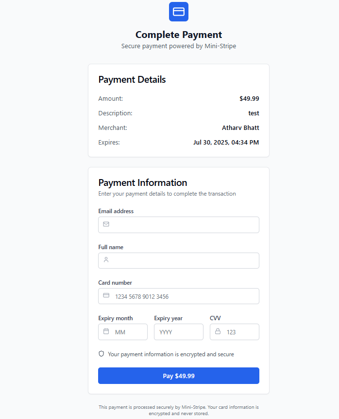

# Mini-Stripe Payment Platform

A simplified Stripe-like payment processing platform built with Node.js, Express, PostgreSQL, and React. This project demonstrates secure payment processing, user authentication, transaction management, and modern UI/UX in a production-ready architecture.

## Project Overview

Mini-Stripe is a comprehensive payment platform that allows users to:
- Register and authenticate securely with JWT tokens
- Create shareable payment links with customizable settings
- Process mock payments through a simulated bank API
- Track transactions and payment history with detailed analytics
- Manage user profiles and application settings
- Toggle between light and dark themes with smooth transitions

## Architecture

```
Mini-Stripe/
├── src/                    # Backend source code
│   ├── routes/            # API route handlers
│   ├── middleware/        # Express middleware
│   ├── database/          # Database connection and utilities
│   └── utils/             # Utility functions and logger
├── frontend/              # React frontend application
│   ├── src/
│   │   ├── components/    # Reusable UI components
│   │   ├── pages/         # Page components
│   │   ├── hooks/         # Custom React hooks
│   │   └── lib/           # Utility libraries
│   └── public/            # Static assets
├── migrations/            # Database migration files
├── tests/                 # Unit and integration tests
├── docs/                  # Documentation
├── docker-compose.yml     # Docker services configuration
├── Dockerfile            # Container configuration
└── package.json          # Dependencies and scripts
```

## Quick Start

### Prerequisites
- Node.js 18+
- PostgreSQL 15+
- Docker (optional)

### Local Development

1. **Clone and setup**
   ```bash
   git clone <repository-url>
   cd Mini-Stripe
   npm install
   cd frontend && npm install
   ```

2. **Environment configuration**
   ```bash
   cp env.example .env
   # Edit .env with your database credentials
   ```

3. **Database setup**
   ```bash
   createdb mini_stripe
   npm run migrate
   ```

4. **Start development servers**
   ```bash
   # Terminal 1: Start backend
   npm run dev
   
   # Terminal 2: Start frontend
   cd frontend && npm run dev
   ```

### Docker Setup

```bash
# Start all services
docker-compose up -d

# Run migrations
docker-compose exec api npm run migrate
```

The API will be available at `http://localhost:3000` and the frontend at `http://localhost:5173`

## Documentation

- [API Documentation](./docs/README.md) - Complete API reference
- [Database Schema](./docs/README.md#database-schema) - Database structure
- [Security Features](./docs/README.md#security-features) - Security implementation

## Testing

```bash
# Run all tests
npm test

# Run with coverage
npm run test:coverage

# Watch mode
npm run test:watch
```

## Development Scripts

```bash
npm run dev          # Start development server
npm start           # Start production server
npm test            # Run tests
npm run lint        # Run ESLint
npm run migrate     # Run database migrations
```

## Security Features

- **Authentication**: JWT-based authentication with bcrypt password hashing
- **Input Validation**: Comprehensive validation using express-validator
- **Rate Limiting**: Configurable rate limiting for API protection
- **Data Masking**: Sensitive data (card numbers) are masked in responses
- **SQL Injection Prevention**: Parameterized queries throughout
- **CORS Protection**: Configurable CORS settings
- **Security Headers**: Helmet middleware for security headers

## Key Features

### User Management
- Secure user registration and login with JWT tokens
- Password change functionality with validation
- User profile management with real-time updates
- Account settings and preferences

### Payment Links
- Create unique, shareable payment links
- Configurable expiry dates and usage limits
- Link status management (active/inactive)
- Payment link analytics and usage tracking
- Copy and view payment links with proper frontend URLs

### Payment Processing
- Mock bank API integration with realistic responses
- Card validation and processing
- Transaction status tracking (pending, processing, completed, failed)
- Payment failure handling with detailed error messages
- Test card numbers for different scenarios

### Transaction Management
- Complete transaction history with filtering
- Transaction status tracking and analytics
- Payment analytics and reporting
- Export capabilities (UI ready)
- Detailed transaction information

### User Interface
- Modern, responsive React frontend with TypeScript
- Dark mode support with smooth transitions
- Toast notifications for user feedback
- Loading states and error handling
- Mobile-friendly design

## User Interface Screenshots

### 
**Description**: Most imporant section of the project.

###  
**Description**: The main landing page showing the Mini-Stripe branding, hero section with call-to-action buttons, and feature highlights.

### 
**Description**: The main dashboard showing user welcome message, statistics cards (Total Revenue, Active Links, Success Rate, Total Transactions), quick actions, and recent activity sections.

### 
**Description**: The payment links management page showing a grid of payment link cards with amounts, descriptions, status badges, usage information, and action buttons (Copy, View, Deactivate).

### 
**Description**: The payment link creation form with fields for amount, currency, description, expiry date, maximum uses, and a live preview section.

### 
**Description**: The public payment page showing payment details, a secure payment form with card information fields, and security notices.

### 
**Description**: The payment success modal showing a green checkmark, success message, transaction ID, and close button.

### 
**Description**: The transactions page showing a table of transactions with customer information, amounts, status badges, dates, and action buttons.

### 
**Description**: The settings page with notification preferences, appearance settings (dark mode toggle), and security settings.

## Database

The application uses PostgreSQL with the following main tables:
- **users**: User account information
- **payment_links**: Payment link details
- **transactions**: Payment transaction records

See [Database Schema](./docs/README.md#database-schema) for complete details.

## Deployment

### Production Setup

1. Set production environment variables
2. Configure production PostgreSQL database
3. Enable HTTPS/SSL
4. Set up monitoring and logging
5. Configure rate limiting for production traffic

### Docker Deployment

```bash
# Build and run
docker build -t mini-stripe-backend .
docker run -d -p 3000:3000 mini-stripe-backend
```

## Contributing

1. Fork the repository
2. Create a feature branch
3. Make your changes
4. Add tests for new functionality
5. Ensure all tests pass
6. Submit a pull request

## Support

For questions and support:
- Check the [documentation](./docs/README.md)
- Review the test files for usage examples
- Create an issue in the repository

---

**Note**: This is a demonstration project for educational purposes. It includes mock payment processing and should not be used for real financial transactions without proper security audits and compliance measures. 
